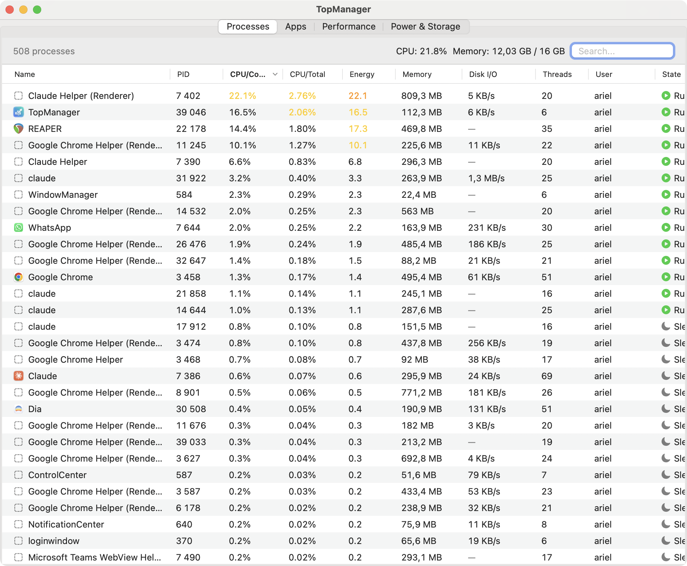
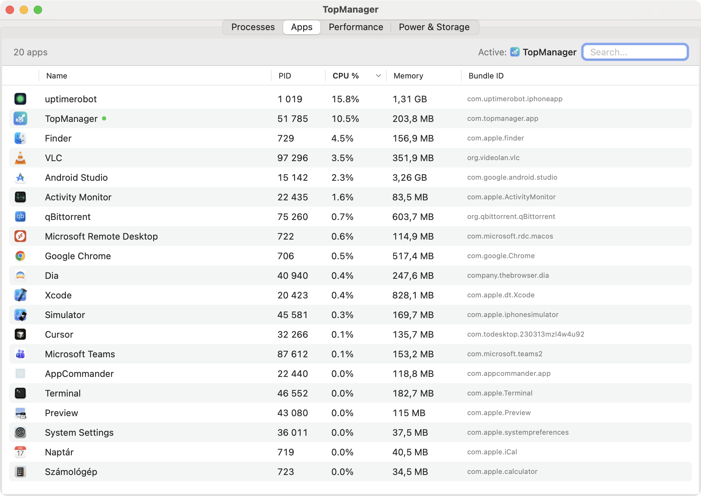
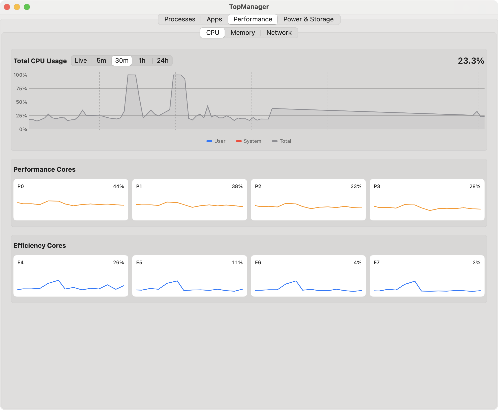
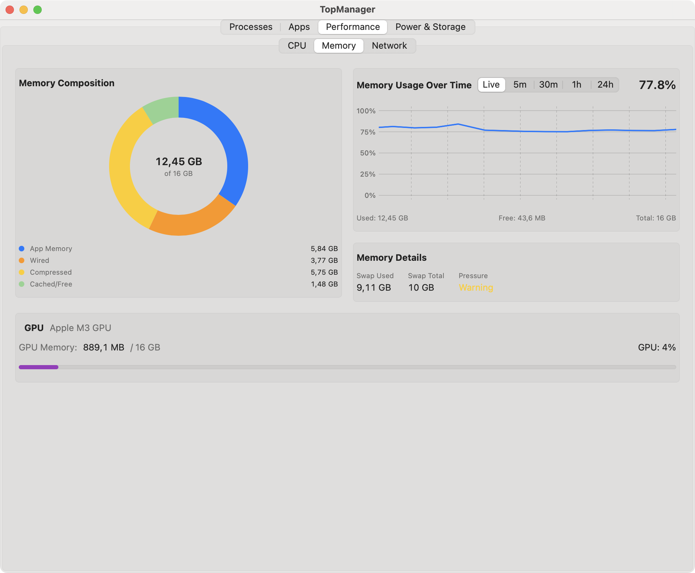
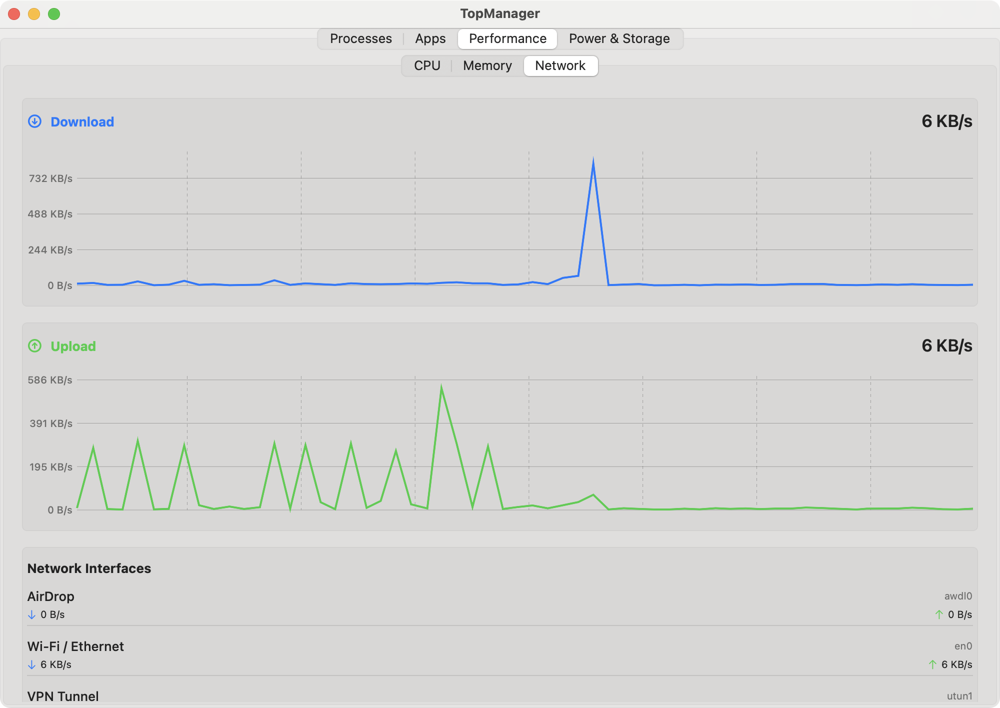
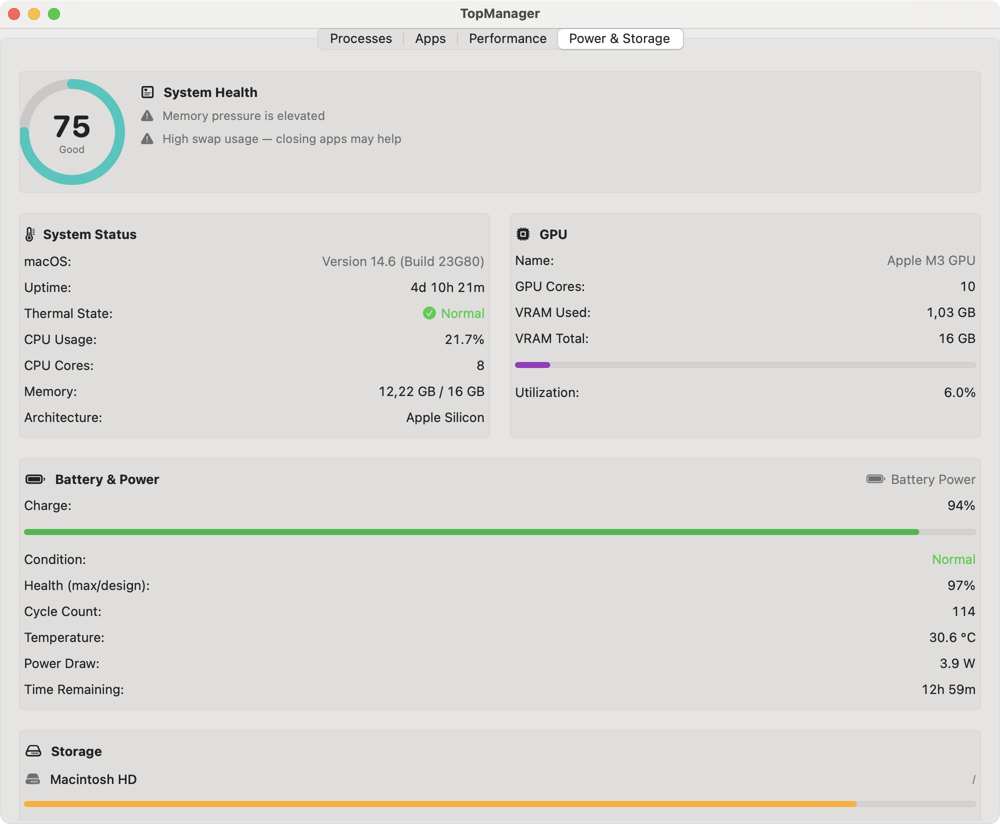

# TopManager

A native macOS system monitor application built with SwiftUI. TopManager provides real-time monitoring of system resources including processes, applications, CPU, memory, GPU, storage, and network.


## Download

**[⬇️ Download TopManager 1.1 (.dmg)](https://github.com/hariel1985/TopManager/releases/latest)**

Signed with a Developer ID and **notarized by Apple** — it opens without Gatekeeper
warnings. Open the DMG and drag TopManager to your Applications folder.
All [releases](https://github.com/hariel1985/TopManager/releases).

## Screenshots

### Processes


### Apps


### Performance - CPU


### Performance - Memory


### Performance - Network


### Power & Storage


## Features

### Processes Tab
- View all running processes with CPU, memory, thread, **energy-impact**, and
  **per-process disk I/O** information
- Sort by any column (name, PID, CPU/Core, CPU/Total, Energy, memory, Disk I/O, threads, user, state)
- Process states: Running, Sleeping, Stopped, Zombie
- Context menu to terminate, force kill, suspend, or resume processes
- **Deep-dive inspector** (double-click / ⌘I): full executable path, launch
  arguments, open-file count, disk totals, energy, parent PID, Reveal in Finder
- Search processes by name or PID

### Apps Tab
- View running user-facing applications
- Shows app icons, CPU/memory usage, and bundle identifiers
- Quick actions: Activate, Hide, Quit, Force Quit
- Copy bundle ID to clipboard

### Performance Tab
- Real-time CPU usage graphs (global and per-core)
- **Selectable time range** (Live / 5m / 30m / 1h / 24h) backed by persistent history
- Memory usage visualization with donut chart
- Network throughput monitoring
- Support for Apple Silicon P-cores and E-cores

### Power & Storage Tab
- **System Health score (0–100)** with plain-language diagnosis of what's wrong
- **Recent Alerts** inbox
- **Battery & Power**: charge, health (cycle-adjusted), cycle count, condition,
  temperature, power draw, time remaining, adapter wattage (via IOKit)
- System status: macOS version, uptime, thermal state
- CPU and GPU core counts
- GPU memory/VRAM usage
- Storage volumes with usage bars
- Network interface statistics

### Proactive monitoring
- **Alerts engine** with native macOS notifications on sustained high CPU,
  critical memory pressure, disk almost full, thermal throttling, runaway
  processes, and low battery — de-duplicated so you're never spammed
- **Persistent metric history** stored to disk; trends survive restarts

### Menu Bar
- Configurable menu-bar metric (CPU % / Memory % / Health / Download)
- Dropdown with live CPU/memory/network/GPU/battery, System Health score, and
  **Top CPU Consumers** with one-click quit

### Settings (⌘,)
- **Launch at login** (SMAppService)
- Adjustable refresh interval (1–30 s)
- Notification toggle and alert thresholds (CPU, disk, low battery)

## Requirements

- macOS 13.0 or later
- Xcode 15.0 or later (for building)

## Building

1. Clone the repository:
   ```bash
   git clone https://github.com/hariel1985/TopManager.git
   ```

2. Open `TopManager.xcodeproj` in Xcode

3. Build and run (⌘R)

## License

This project is licensed under the GNU General Public License v3.0 - see the [LICENSE](LICENSE) file for details.

## Testing

Logic is covered by an XCTest suite (`TopManagerTests`, 55 tests) run via
`scripts/test.sh test`. The full manual + automated process is documented in
[docs/TESTING.md](docs/TESTING.md), and the product direction in
[docs/VALUE_PLAN.md](docs/VALUE_PLAN.md).

## Acknowledgments

Built with SwiftUI and native macOS APIs including:
- `libproc` / `rusage_info` for process information, disk I/O and energy signals
- `IOKit` for GPU, battery (AppleSmartBattery) and hardware monitoring
- `Metal` for GPU detection
- `SystemConfiguration` for network monitoring
- `UserNotifications` for proactive alerts
- `ServiceManagement` (SMAppService) for launch-at-login
- Swift `Charts` for time-series visualization
